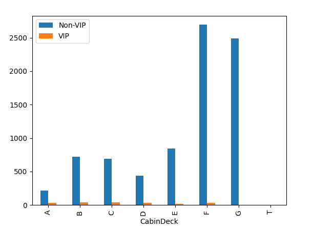
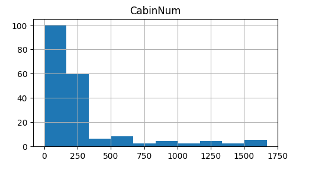
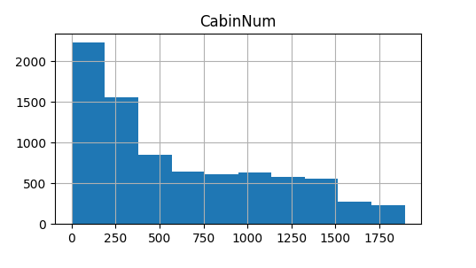

# Logistic Regression - Kaggle SpaceShip Titanic 

## Overview

We want to solve the Kaggle's [SpaceShip Titanic](https://www.kaggle.com/competitions/spaceship-titanic/overview) challenge, in order to practice logistic regression for binary classification.

> Welcome to the year 2912, where your data science skills are needed to solve a cosmic mystery. We've received a transmission from four lightyears away and things aren't looking good.\
\
The Spaceship Titanic was an interstellar passenger liner launched a month ago. With almost 13,000 passengers on board, the vessel set out on its maiden voyage transporting emigrants from our solar system to three newly habitable exoplanets orbiting nearby stars.\
\
While rounding Alpha Centauri en route to its first destination—the torrid 55 Cancri E—the unwary Spaceship Titanic collided with a spacetime anomaly hidden within a dust cloud. Sadly, it met a similar fate as its namesake from 1000 years before.\
Though the ship stayed intact, almost half of the passengers were transported to an alternate dimension!\
\
To help rescue crews and retrieve the lost passengers, you are challenged to predict which passengers were transported by the anomaly using records recovered from the spaceship’s damaged computer system.\
Help save them and change history!\
\
-- <cite> Addison Howard, Ashley Chow, Ryan Holbrook

## Workflow

### Model

We will use a sigmoid function $g$ to compute the output of our model :

$$
g(z) = \frac{1}{1 + e^{-z}}
$$

With $z$ being a linear equation :

$$
z = \vec{w}\cdot \vec{x} + b
$$

Resulting in model $f$ :

$$
f_{\vec{w}, b}(\vec{x}) = g(\vec{w}\cdot \vec{x} + b) = \frac {1} {1 + e ^ {-(\vec{w} \cdot \vec{x} + b)}}
$$

### Data processing

- Select relevant features to solve the problem
- Tokenize string features
- Scale the data to range between $[0\cdots 1]$

#### Filling missing data
Let's take a look at the dataset information :

| # | Column      | Non-Null Count |  Dtype  |
|:-:|:-----------:|:--------------:|:-------:|
| 0 | PassengerId | 8693           | object  |
| 1 | HomePlanet  | 8492           | object  |
| 2 | CryoSleep   | 8476           | object  |
| 3 | Cabin       | 8494           | object  |
| 4 | Destination | 8511           | object  |
| 5 | Age         | 8514           | float64 |
| 6 | VIP         | 8490           | object  |
| 7 | RoomService | 8512           | float64 |
| 8 | FoodCourt   | 8510           | float64 |
| 9 | ShoppingMail| 8485           | float64 |
|10 | Spa         | 8510           | float64 |
|11 | VRDeck      | 8505           | float64 |
|12 | Name        | 8493           | object  |
|13 | Transported | 8693           | bool    |

We can see every column is missing data but the **PassengerId** and the **Transported** columns.

##### Name and PassengerId

If we take a closer look to the **PassengerId** column and relate it to the **Name** column, we can make sense of the passenger id's pattern :

|    |   PassengerId | Name               |
|---:|--------------:|:-------------------|
|  0 |       0001_01 | Maham Ofracculy    |
|  1 |       0002_01 | Juanna Vines       |
|  2 |       0003_01 | Altark Susent      |
|  3 |       0003_02 | Altark Susent      |
|  4 |       0004_01 | Willy Santantines  |
|  5 |       0005_01 | Sandie Hinetthews  |
|  6 |       0006_01 | Billex Jacostaffey |
|  7 |       0006_02 | Billex Jacostaffey |
|  8 |       0007_01 | Andona Beston      |
|  9 |       0008_01 | Erraiam Flatic     |

From the rows 2, 3 and 6, 7 we can understand that the four first digits are used to identify the person's last name, and the last two digits to identify the person amongst its family.

We can simplify the **Name** column by only keeping the lastname, and trying to fill in the blanks according to the **PassengerId** column, with values sharing the same four first digits.

Another approach if we need to infer data from being members of a same family would simply be to split the ids with the underscore and create a new column named **FamilyId**

##### Cabin and Family

Now that we've found a way to group people by family, we can try to fill in some blanks in the **Cabin** column if we assume that people from the same family will share common cabins, or at least same kind of cabins.

From the data field description, we know that the cabin number is formatted according to the pattern **deck/num/side**.

To see correlations more easily, we can create 3 new columns out of the **Cabin** column, being **CabinDeck**, **CabinNumber** and **CabinSide**.

**Deck Data**

Let's see if we can find a correlation between the Deck of the cabin and wether the person in it is VIP or not :

| CabinDeck   |   Non-VIP |   VIP |  VIP% |
|:------------|----------:|------:|------:|
| A           |       215 |    35 | 14    |
| B           |       725 |    42 |  5.48 |
| C           |       687 |    41 |  5.63 |
| D           |       438 |    31 |  6.61 |
| E           |       846 |    15 |  1.74 |
| F           |      2695 |    29 |  1.06 |
| G           |      2493 |     0 |  0    |
| T           |         5 |     0 |  0    |
| Total       |      8104 |   193 |  2.33 |

We can make several observations from the table and graph above:
- The majority of the passengers (64%) are located on the decks F and G
- There is an over-representation of VIP passengers in the decks A, B, C and D, and under-represented on decks E and F, compared with their proportion amongst the passengers on the ship
- The deck A is the deck with the highest proportion of VIP passengers
- No VIP did travel on decks G and T

**Cabin number data**

Histogram of the quantity of passengers according to VIP status versus room number :

| VIP | Non-VIP |
|:---:|:-------:|
|  ||

From those graphs we can see that, either VIP or not, the cabins that received the highest proportion of passengers range between 0 and 300.

Almost 83% of the VIP passengers where located in a cabin whose number ranged between 0 and 300.

About 48% of the non-VIP passengers where located in a cabin with a number in the same range.

**Cabin side**

| CabinSide   |   Non-VIP |   VIP |    % |
|:------------|----------:|------:|-----:|
| P           |      4011 |   102 | 2.48 |
| S           |      4093 |    91 | 2.17 |
| Total       |      8104 |   193 | 2.33 |

Looking again at the repartition of VIP passengers, we can see that the side of the cabin doesn't seem to be correlated to the VIP status of the passengers.

**Filling the missing values**

We can now establish a strategy to fill the missing data of the cabin columns :

- According to the VIP status of the passenger, we'll assign the cabin deck and the cabin number with a probability proportional to their repartition in those categories
- The cabin side will be assigned with an equal probability of 50%
- If some values are still missing because we don't know the VIP status of the passenger, we'll try to assign it the same room as one of its family member, hoping that he wasn't traveling alone.

### Training

#### Loss function

The loss function used to measure the difference between the prediction for one input and its associated target :

$$
L(f_{\vec{w}, b}(\vec{x^{(i)}}), y^{(i)}) = \begin{cases}
    \begin{array}{ll}
        -\log(f_{\vec{w}, b}(\vec{x}^{(i)})) & \text{if  } y^{(i)}=1 \\
        -\log(1 - f_{\vec{w}, b}(\vec{x}^{(i)})) & \text{if  } y^{(i)}=0
    \end{array}
\end{cases}
$$

Simplified to :

$$
L(f_{\vec{w}, b}(\vec{x^{(i)}}), y^{(i)}) = -y^{(i)}\log(f_{\vec{w}, b}(\vec{x}^{(i)})) - (1 - y^{(i)})\log(1-f_{\vec{w}, b}(\vec{x}^{(i)}))
$$

#### Regularization function

We will use a regularization function to minimize the overfitting of the data during training:

$$
R(\vec{w}) = \frac {\lambda} {2m} \sum^n_{j=1}w^2_j
$$

With $\lambda$ being the regularization parameter and $m$ the number of examples in the dataset.

#### Cost function

We measure the overall error of the model for the whole training set:

$$
J(\vec{w}, b) = \frac{1}{m}\sum^m_{i=1}[L(f_{\vec{w}, b}(\vec{x}), y^{(i)})] + R(\vec{w})
$$

#### Cost derivatives

Partial derivative of $J$ with respect to $\vec{w}_j$ :

$$
\frac {\delta} {\delta \vec{w}_j} J(\vec{w}, b) = \frac {1} {m} \sum^m_{i=1}[(f_{\vec{w}, b}(\vec{x}) - y^{(i)})x^{(i)}_j] + \frac {\lambda} {m}w_j
$$

Partial derivative of $J$ with respect to $\vec{w}_j$ :

$$
\frac {\delta} {\delta b} J(\vec{w}, b) = \frac {1} {m} \sum^m_{i=1}(f_{\vec{w}, b}(\vec{x}) - y^{(i)})
$$

#### Descent

We will repeat until convergence is met or maximum number of iteration is reached, with $\alpha$ being the model learning rate :

$$
\begin{aligned}
    & \vec{w}_j = \vec{w}_j - \alpha \frac{\delta}{\delta \vec{w}_j} J(\vec{w}, b)\\
    & b=b - \alpha \frac{\delta}{\delta b} J(\vec{w}, b)
\end{aligned}\\
$$
